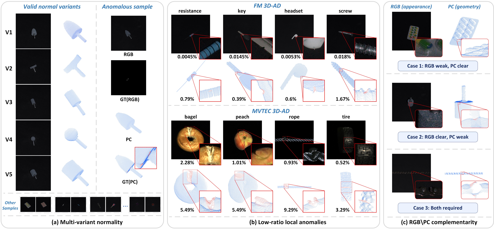
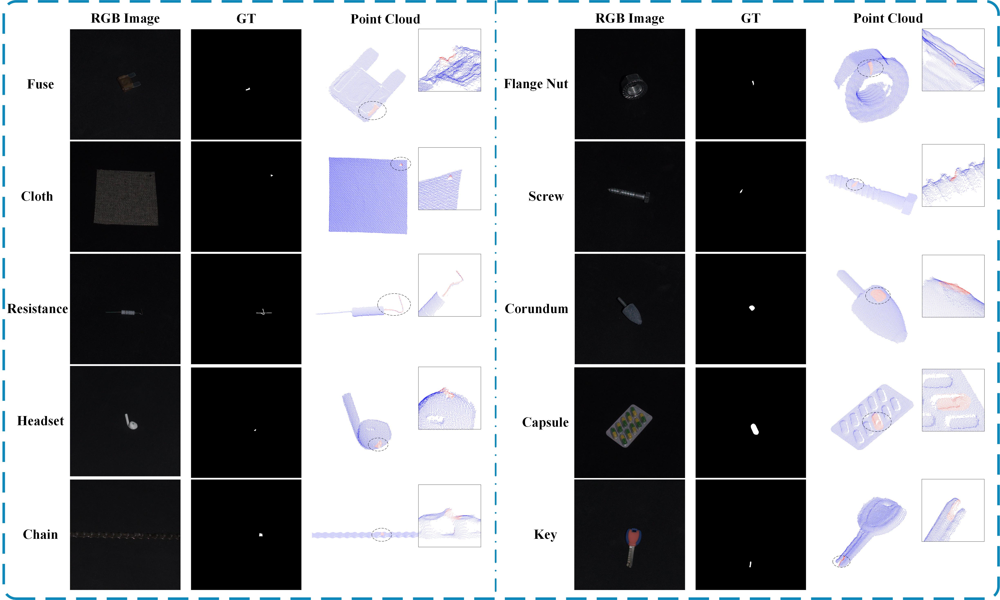

# FM3D-IAD

## A Fine-Grained RGB–Point Cloud Dataset and Benchmark for Industrial Anomaly Detection

[](#benchmark-protocol)
[](#dataset-overview)
[](#dataset-overview)
[](#dataset-overview)

FM3D-IAD is a real-sensor RGB–point cloud (RGB-PC) dataset and benchmark for fine-grained industrial anomaly detection. It contains **2,492 aligned RGB image and XYZ point-cloud pairs** from **10 industrial object categories**, together with modality-specific pixel-level and point-level annotations for anomalous samples.

The dataset is designed to evaluate anomaly detection under three characteristics frequently encountered in precision inspection:

- production-acceptable normal variation within the same category;
- small, localized defects with low image-space support;
- complementary anomaly evidence in RGB appearance and 3D geometry.

<p align="center">
  
</p>

## Table of Contents

- [News](#news)
- [Dataset Overview](#dataset-overview)
- [Sensor and Acquisition](#sensor-and-acquisition)
- [Annotations](#annotations)
- [Object Categories and Splits](#object-categories-and-splits)
- [Directory Structure](#directory-structure)
- [File Formats and Sample Pairing](#file-formats-and-sample-pairing)
- [Download](#download)
- [Getting Started](#getting-started)
- [Benchmark Protocol](#benchmark-protocol)
- [GammaNet Reference Baseline](#gammanet-reference-baseline)
- [Citation](#citation)
- [License](#license)
- [Contact](#contact)

## News

- **2026-09:** Repository documentation and the FM3D-IAD release structure were updated.
- Paper, dataset-download, and benchmark-code updates will be announced here.

## Dataset Overview

| Property | FM3D-IAD |
|---|---:|
| RGB–XYZ pairs | 2,492 |
| Object categories | 10 |
| Category-specific anomaly subtypes | 45 |
| Normal training samples | 1,520 |
| Normal test samples | 183 |
| Anomalous test samples | 789 |
| Released RGB resolution | 800 × 800 |
| RGB annotation | Pixel-level binary mask |
| Point-cloud annotation | Point-level binary label |
| Supported tasks | Object detection, RGB pixel localization, 3D point localization |

Only normal samples are used for training. The test set contains both normal and anomalous samples. Each physical object was captured once, and its aligned RGB–XYZ pair belongs exclusively to either the training set or the test set.

<p align="center">
  
</p>

## Sensor and Acquisition

All RGB-PC pairs were acquired using a **Zivid 2+ MR60** industrial structured-light 3D camera at a working distance of **600 mm**.

| Acquisition item | Setting |
|---|---|
| Native RGB resolution | 2448 × 2048 pixels (5.0 MP) |
| Released image space | Fixed paired crop of 800 × 800 |
| Spatial resolution at 600 mm | 0.24 mm |
| Typical point precision at 600 mm | 80 μm |
| Camera setup | Statically mounted |
| Background | Dark background |
| Illumination | Indirect diffuse illumination |
| Modalities | Synchronously acquired RGB and XYZ |
| Released point attributes | XYZ only; RGB attributes are not duplicated in point files |

RGB and XYZ are produced by the same acquisition device and retain their paired correspondence after the fixed crop.

## Annotations

FM3D-IAD provides annotations in the native domain of each modality:

- **RGB domain:** pixel-level masks were manually delineated with LabelMe.
- **Point-cloud domain:** point-level labels were manually annotated with CloudCompare.

The point-level labels are **not** obtained by directly projecting the RGB masks. A region is labeled in a modality only when the defect is directly observable in that sensing domain.

For normal test samples, the released RGB mask and point-label files contain all-zero labels. Training samples are normal and contain only RGB and XYZ data.

## Object Categories and Splits

The public directory names are shown exactly as they appear in the release. Display names used in the paper are given in parentheses where needed.

| Directory / category | Train normal | Test normal | Test anomaly | Anomaly subtype directories |
|---|---:|---:|---:|---|
| `capsule` | 180 | 20 | 80 | `colored`, `combined`, `jnbroken`, `miss` |
| `chain` | 180 | 20 | 73 | `broken`, `colored`, `combined`, `miss` |
| `cloth` | 150 | 15 | 90 | `colored`, `combined`, `contaminated`, `cut`, `hole`, `ladder` |
| `corundum_abrasives` (Corundum) | 153 | 18 | 72 | `broken`, `colored`, `combined`, `glue` |
| `flange_nut` (Flange Nut) | 86 | 18 | 78 | `colored`, `combined`, `cut`, `damaged` |
| `fuse` | 180 | 20 | 100 | `colored`, `combined`, `fuse_bend`, `fuse_damaged`, `shell_damaged` |
| `headset` | 180 | 20 | 100 | `broken`, `colored`, `combined`, `error`, `miss` |
| `key` | 170 | 20 | 72 | `broken`, `colored`, `combined`, `damaged` |
| `resistance` | 135 | 21 | 61 | `broken`, `colored`, `combined`, `damaged_lead` |
| `screw` | 106 | 11 | 63 | `body_broken`, `colored`, `combined`, `head_broken`, `tail_broken` |
| **Total** | **1,520** | **183** | **789** | **45 category-specific subtypes** |

> **Legacy names.** Some archives may extract to a root directory named `Neu3D-AD`. This is a legacy internal name for the FM3D-IAD release. The internal layout is unchanged, and the root directory may be renamed to `FM3D-IAD`. The folder name `jnbroken` is retained for compatibility with the released split and should not be interpreted as a new category.

## Directory Structure

Each object category follows the same split-first structure. The example below uses `capsule`.

```text
FM3D-IAD/                         # Some archives use the legacy root name Neu3D-AD/
├── capsule/
│   ├── train/
│   │   └── good/
│   │       ├── rgb/
│   │       │   ├── 000.png
│   │       │   └── ...
│   │       └── xyz/
│   │           ├── 000.xyz
│   │           └── ...
│   └── test/
│       ├── good/
│       │   ├── rgb/
│       │   ├── rgb_gt/
│       │   ├── xyz/
│       │   └── xyz_gt/
│       ├── colored/
│       │   ├── rgb/
│       │   │   ├── 000.png
│       │   │   └── ...
│       │   ├── rgb_gt/
│       │   │   ├── 000.png
│       │   │   └── ...
│       │   ├── xyz/
│       │   │   ├── 000.xyz
│       │   │   └── ...
│       │   └── xyz_gt/
│       │       ├── 000.txt
│       │       └── ...
│       ├── combined/
│       ├── jnbroken/
│       └── miss/
├── chain/
├── cloth/
├── corundum_abrasives/
├── flange_nut/
├── fuse/
├── headset/
├── key/
├── resistance/
└── screw/
```

## File Formats and Sample Pairing

| Path component | Format | Description |
|---|---|---|
| `rgb/` | `.png` | Released RGB image in the 800 × 800 image space |
| `rgb_gt/` | `.png` | Pixel-level binary anomaly mask aligned with the RGB image |
| `xyz/` | `.xyz` | Point cloud containing XYZ coordinates only |
| `xyz_gt/` | `.txt` | Point-level binary anomaly labels, ordered consistently with the rows of the corresponding XYZ file |

Files are paired by their **relative category, split, subtype, and filename stem**. For example:

```text
capsule/test/colored/rgb/000.png
capsule/test/colored/rgb_gt/000.png
capsule/test/colored/xyz/000.xyz
capsule/test/colored/xyz_gt/000.txt
```

The stem `000` is local to its subtype directory and is not a globally unique sample identifier. A robust loader should therefore use the complete relative key:

```text
<category>/<split>/<subtype>/<stem>
```

The released point clouds have heterogeneous native point counts. Across the 2,492 samples, the number of valid finite, nonzero XYZ measurements ranges from **1,837 to 178,385** per sample. Benchmark loaders should not assume a uniform number of points unless the selected method performs its own grouping or sampling.

## Download

The repository contains the documentation and benchmark implementation. The full dataset should be downloaded from the public release location announced by the maintainers.

- **Repository:** https://github.com/1366313339gao-a11y/FM3D-IAD
- **Dataset archive:** add the final public dataset URL here before release.
- **Pretrained Point-MAE checkpoint:** use the official Point-MAE checkpoint required by the selected 3D baseline.

After downloading, arrange the files as follows:

```text
FM3D-IAD/
├── datasets/
│   └── FM3D-IAD/
│       ├── capsule/
│       ├── chain/
│       └── ...
├── checkpoints/
│   └── pointmae_pretrain.pth
└── ...
```

## Getting Started

Clone the repository:

```bash
git clone https://github.com/1366313339gao-a11y/FM3D-IAD.git
cd FM3D-IAD
```

Place the dataset under the path expected by the selected configuration. Because baseline implementations may use different loaders, keep the released category/split/subtype hierarchy unchanged.

The following optional check verifies that every test leaf has matching RGB, RGB-mask, XYZ, and point-label stems:

```python
from pathlib import Path

root = Path("datasets/FM3D-IAD")

for category in sorted(p for p in root.iterdir() if p.is_dir()):
    for subtype in sorted((category / "test").iterdir()):
        if not subtype.is_dir():
            continue
        stems = {
            "rgb": {p.stem for p in (subtype / "rgb").glob("*.png")},
            "rgb_gt": {p.stem for p in (subtype / "rgb_gt").glob("*.png")},
            "xyz": {p.stem for p in (subtype / "xyz").glob("*.xyz")},
            "xyz_gt": {p.stem for p in (subtype / "xyz_gt").glob("*.txt")},
        }
        reference = stems["rgb"]
        assert all(value == reference for value in stems.values()), (
            category.name,
            subtype.name,
            {key: len(value) for key, value in stems.items()},
        )

print("FM3D-IAD test-set pairing check passed.")
```

## Benchmark Protocol

FM3D-IAD supports three evaluation tasks:

1. **Object-level anomaly detection** — sample-wise anomaly scores are evaluated against the common sample label using AUROC.
2. **Pixel-level RGB localization** — RGB and RGB-PC image-space outputs are compared with manually annotated RGB masks. GammaNet uses 224 × 224 RGB inputs; masks are resized to 224 × 224 using nearest-neighbor interpolation for evaluation.
3. **Point-level 3D localization** — point-cloud-only outputs are compared directly with manually annotated point labels in the native 3D point-cloud domain. Point scores and labels are not projected to the RGB image plane.

For localization, category-wise AUROC pools predictions and labels over **all test samples**. Normal samples use all-zero localization labels. The reported `Mean` is the unweighted average of the ten category-wise AUROCs.

RGB-only baselines are implemented using [Anomalib](https://github.com/openvinotoolkit/anomalib) with default or recommended configurations. Point-cloud-only and existing RGB-PC baselines follow their official implementations and original configurations unless otherwise stated. All methods use the same FM3D-IAD training and test splits.

## GammaNet Reference Baseline

GammaNet is provided as a reproducible RGB-PC reference baseline rather than the primary contribution of the dataset paper. It uses:

- a DINO-pretrained ViT-B/8 RGB encoder;
- a Point-MAE-pretrained Point Transformer for XYZ data;
- a parameter-free PC-to-RGB interaction;
- independent RGB and point-cloud memory banks;
- modality-specific anomaly scoring followed by score fusion.

The reference implementation uses 224 × 224 RGB inputs and retains all successfully parsed XYZ points before Point-MAE grouping. Detailed architecture and benchmark settings are provided in the paper and configuration files.

## Citation

If FM3D-IAD is useful in your research, please cite:

```bibtex
@misc{gao2026fm3diad,
  title  = {FM3D-IAD: A Fine-Grained RGB--Point Cloud Dataset and Benchmark for Industrial Anomaly Detection},
  author = {Gao, Simin and Wu, Yakun and Zhang, Yunzhou},
  year   = {2026},
  note   = {Manuscript under review}
}
```

The BibTeX entry will be updated after formal publication.

## License

Please add the final dataset and code license before public distribution. The README should state separately whether the dataset and source code use the same terms, and whether commercial use or redistribution requires additional permission.

## Contact

For questions about FM3D-IAD, please contact:

- Yunzhou Zhang: `zhangyunzhou@mail.neu.edu.cn`
- Yakun Wu: `wykyjs1@163.com`

## Acknowledgements

The benchmark builds on public implementations and pretrained representations including Anomalib, DINO, Point-MAE, PatchCore, M3DM, and related industrial anomaly-detection methods. We thank their authors for making their work available.

