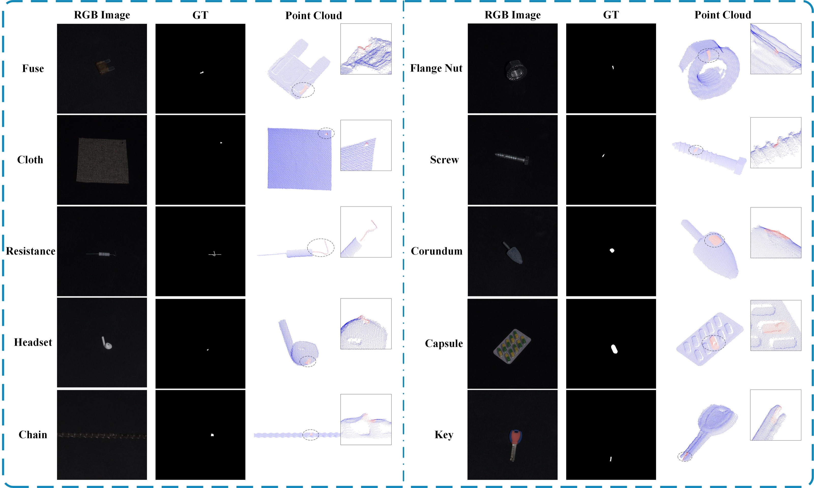
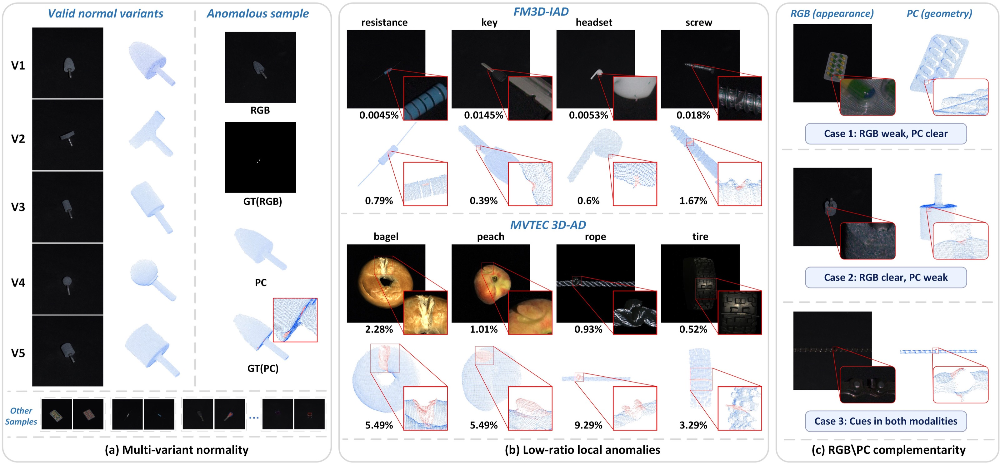

# FM3D-IAD

### A Fine-Grained RGB–Point Cloud Dataset and Benchmark for Industrial Anomaly Detection

[](#dataset-at-a-glance)
[](#dataset-at-a-glance)
[](#categories-and-splits)
[](#categories-and-splits)

**FM3D-IAD** is a real-sensor benchmark for fine-grained industrial anomaly detection with aligned RGB images and XYZ point clouds. It contains **2,492 paired captures across 10 object categories**, with manually annotated RGB pixel masks and 3D point labels for anomalous test samples. The benchmark covers object-level detection, RGB pixel localization, and point-level 3D localization.

<p align="center">
  <a href="https://drive.google.com/file/d/15x1CgJNCqwG36SktgncbHVFpFharV_lh/view"><strong>Download the dataset</strong></a>
  &nbsp;·&nbsp;
  <a href="paper/FM3D-IAD.pdf"><strong>Read the paper</strong></a>
  &nbsp;·&nbsp;
  <a href="#dataset-layout"><strong>Explore the file layout</strong></a>
</p>

<p align="center">
  
</p>
<p align="center"><em>Representative RGB images, RGB ground-truth masks, and XYZ point clouds from all ten categories.</em></p>

## What makes FM3D-IAD useful?

- **Valid normal variation.** Different appearances and shapes within one category may all be acceptable.
- **Small image-space defects.** The median anomalous RGB mask occupies **0.078%** of the full image; **97.34%** of anomalous masks occupy at most **0.5%**.
- **Complementary modalities.** Defect evidence can be clearer in RGB appearance, 3D geometry, or both. The RGB and point-cloud annotations are made separately according to visibility in each modality.
- **Real paired measurements.** Each RGB–XYZ pair was acquired together with an industrial structured-light camera. The defects were physically introduced under controlled conditions.

<p align="center">
  
</p>

## Dataset at a glance

| Property | Value |
| --- | ---: |
| Aligned RGB–XYZ pairs | **2,492** |
| Industrial object categories | **10** |
| Category-specific anomaly subtypes | **45** |
| Normal training samples | **1,520** |
| Normal test samples | **183** |
| Anomalous test samples | **789** |
| Released RGB image space | **800 × 800** pixels |
| Labels | RGB pixel masks and XYZ point labels |

Training uses normal samples only. Each physical object was captured once; its paired RGB and XYZ measurements belong to one split. The XYZ files contain geometry without duplicated RGB attributes. Valid point counts vary from **1,837 to 178,385** across released samples, so a loader should not assume a fixed number of points.

### Categories and splits

The directory names below follow the dataset layout described in the supplied README. The display names in parentheses match the paper where they differ.

| Category directory | Train normal | Test normal | Test anomaly | Anomaly subtypes |
| --- | ---: | ---: | ---: | ---: |
| `capsule` | 180 | 20 | 80 | 4 |
| `chain` | 180 | 20 | 73 | 4 |
| `cloth` | 150 | 15 | 90 | 6 |
| `corundum_abrasives` (Corundum) | 153 | 18 | 72 | 4 |
| `flange_nut` (Flange Nut) | 86 | 18 | 78 | 4 |
| `fuse` | 180 | 20 | 100 | 5 |
| `headset` | 180 | 20 | 100 | 5 |
| `key` | 170 | 20 | 72 | 4 |
| `resistance` | 135 | 21 | 61 | 4 |
| `screw` | 106 | 11 | 63 | 5 |
| **Total** | **1,520** | **183** | **789** | **45** |

## Download

**[Download FM3D-IAD from Google Drive](https://drive.google.com/file/d/15x1CgJNCqwG36SktgncbHVFpFharV_lh/view)** and extract the archive. Keep the category, split, and subtype folders intact.

Some release archives may extract to a root folder named `Neu3D-AD`, a legacy internal name noted in the supplied README. The root folder can be renamed to `FM3D-IAD`; the category folders should retain their released names. In particular, `jnbroken` is a released subtype directory name under `capsule`.

## Dataset layout

Each category has a normal-only training split and a test split with normal and anomalous subtypes. For example:

```text
FM3D-IAD/
├── capsule/
│   ├── train/
│   │   └── good/
│   │       ├── rgb/       # 000.png, ...
│   │       └── xyz/       # 000.xyz, ...
│   └── test/
│       ├── good/
│       │   ├── rgb/
│       │   ├── rgb_gt/
│       │   ├── xyz/
│       │   └── xyz_gt/
│       ├── colored/
│       │   ├── rgb/
│       │   ├── rgb_gt/
│       │   ├── xyz/
│       │   └── xyz_gt/
│       ├── combined/
│       ├── jnbroken/
│       └── miss/
├── chain/
├── cloth/
├── corundum_abrasives/
├── flange_nut/
├── fuse/
├── headset/
├── key/
├── resistance/
└── screw/
```

| Folder | Format | Contents |
| --- | --- | --- |
| `rgb/` | `.png` | RGB image in the released 800 × 800 image space |
| `rgb_gt/` | `.png` | Binary RGB anomaly mask aligned with the image |
| `xyz/` | `.xyz` | XYZ coordinates, with no duplicated RGB attributes |
| `xyz_gt/` | `.txt` | Binary point labels in the same row order as the corresponding XYZ file |

Files pair by **category / split / subtype / filename stem**. For example, `capsule/test/colored/rgb/000.png` pairs with the `000.png`, `000.xyz`, and `000.txt` files in the sibling `rgb_gt/`, `xyz/`, and `xyz_gt/` folders. A stem such as `000` is only unique within its subtype folder. Normal test samples have all-zero RGB and point labels; normal training samples contain RGB and XYZ data only.

## Acquisition and annotation

RGB and XYZ were captured synchronously with a **Zivid 2+ MR60** structured-light 3D camera at a working distance of **600 mm**. The camera was statically mounted against a dark background with indirect diffuse illumination. A fixed crop was applied to the paired modalities to create the released **800 × 800** image space.

RGB anomaly masks were manually delineated with LabelMe, and point-level labels were manually annotated with CloudCompare. Point labels were not obtained by projecting RGB masks: a defect is labeled in a modality when it is directly observable there.

## Benchmark protocol

| Task | Prediction | Ground truth | Reported metrics |
| --- | --- | --- | --- |
| Object-level detection | One anomaly score per sample | Normal / anomalous sample label | AUROC |
| RGB pixel localization | Anomaly map in image space | Manually annotated RGB mask | AUROC, F1-max, AUPR |
| 3D point localization | One score per valid XYZ point | Manually annotated point labels | AUROC, F1-max, AUPR |

The paper reports category-wise results and an **unweighted mean over the ten categories**. RGB localization is evaluated against the released RGB masks in the **800 × 800** image space; GammaNet upsamples its predicted map to that space. Point-level scores are evaluated directly against point labels in the 3D domain, without projection to the RGB image plane.

The paper benchmarks RGB-only, point-cloud-only, and RGB–point-cloud methods using the same FM3D-IAD splits. **GammaNet** is included as a reproducible RGB–point-cloud reference baseline. It reports a mean object-level AUROC of **0.813** and mean RGB pixel-level AUROC of **0.986**. Point-level localization remains challenging: the strongest reported mean point-level AUROC is **0.584** (BTF with FPFH). These are results from the supplied manuscript; see the [paper](paper/FM3D-IAD.pdf) for per-category results, configurations, and other metrics.

## Citation

If FM3D-IAD is useful in your research, please cite the manuscript:

```bibtex
@misc{gao2026fm3diad,
  title  = {FM3D-IAD: A Fine-Grained RGB--Point Cloud Dataset and Benchmark for Industrial Anomaly Detection},
  author = {Gao, Simin and Wu, Yakun and Zhang, Yunzhou},
  year   = {2026},
  note   = {Manuscript under review}
}
```

## Usage terms and contact

The supplied materials do not specify a dataset or code license. For usage terms or questions about the dataset, contact **Yunzhou Zhang** (`zhangyunzhou@mail.neu.edu.cn`) or **Yakun Wu** (`wykyjs1@163.com`).

## Acknowledgements

The benchmark draws on public implementations and pretrained representations, including Anomalib, DINO, Point-MAE, PatchCore, and M3DM. We thank their authors for making their work available.
